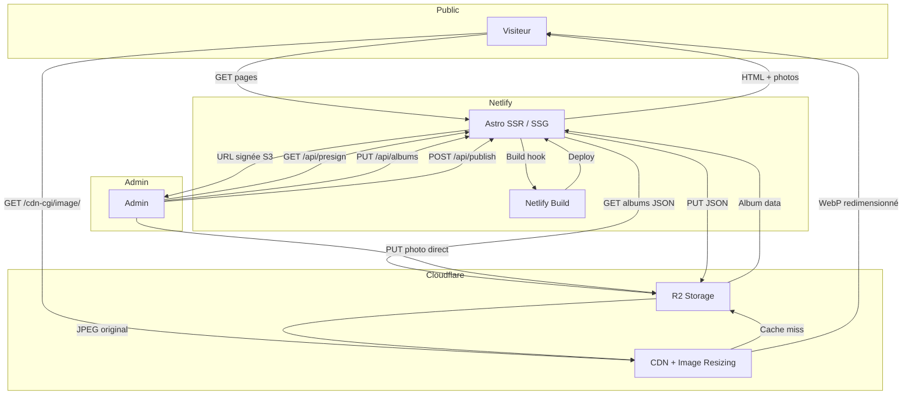
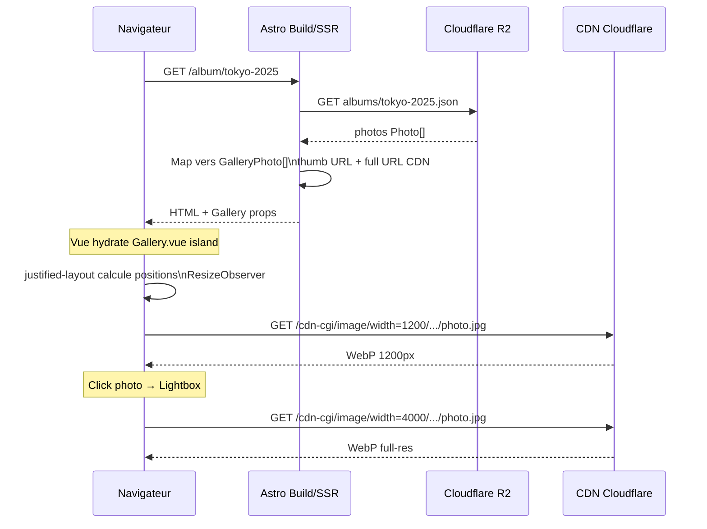
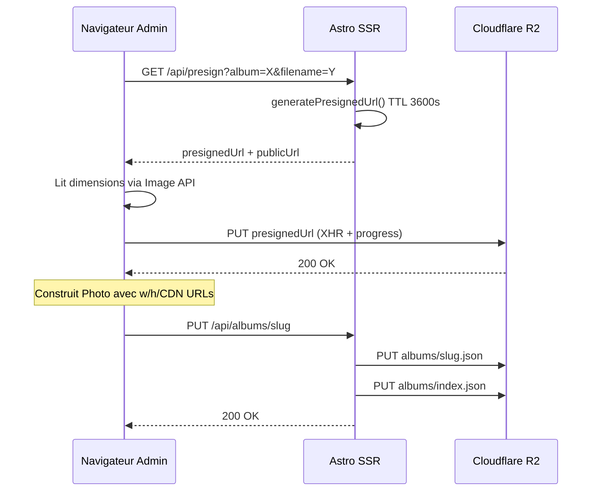

# Portfolio Photo

Portfolio photographique personnel avec galerie, lightbox custom et back-office d'administration. Construit pour remplacer Adobe Lightroom Web — sans abonnement, sans base de données, avec un contrôle total sur le stockage et l'affichage.

[](https://astro.build)
[](https://vuejs.org)
[](https://www.typescriptlang.org)
[](https://developers.cloudflare.com/r2/)
[](https://photo.owenlebec.fr)

**Stack :** Astro 4 · Vue 3 · TypeScript · Tailwind CSS · Cloudflare R2 · Cloudflare Image Resizing · Netlify

**[→ Demo (photo.owenlebec.fr)](https://photo.owenlebec.fr)** · **[→ Étude de cas complète sur mon portfolio](https://owenlebec.fr/projects/portfolio-photo)**

---

## Architecture

Le site tourne en mode **hybrid Astro** : les pages publiques sont pré-rendues au build (statique), les routes `/api/*` et `/admin` tournent en SSR. Pas de framework full-SPA pour du contenu majoritairement statique.



**Pas de base de données** — les métadonnées albums/photos sont stockées en JSON dans R2 (`albums/index.json`, `albums/{slug}.json`). Suffisant pour une collection personnelle, zéro service à maintenir.

**Cloudflare Image Resizing** — redimensionnement à la volée via URL (`/cdn-cgi/image/width=1200,quality=78,format=webp/...`). Aucune pré-génération de vignettes, cache CDN intégré.

### Cycle de vie d'une visite



**Upload direct navigateur → R2** — `/api/presign` génère une URL signée (TTL 3600s), le navigateur PUT directement sur R2 sans transiter par le serveur. Élimine les timeouts sur les gros fichiers.



D'autres schémas (routing statique/SSR/islands) sont disponibles dans l'[étude de cas complète](https://owenlebec.fr/projects/portfolio-photo).

---

## Fonctionnalités notables

- **Galerie justifiée** — layout Flickr (`justified-layout`) recalculé via `ResizeObserver` à chaque changement de largeur
- **Lightbox sans dépendance** — progressive loading (miniature floutée → full-res), zoom molette/pinch/double-tap (max 5×), pan avec clamping, swipe, clavier complet
- **EXIF préservés de bout en bout** — extraction via `exifr` (appareil, objectif, GPS, date), stockés dans les JSON d'album, affichés dans la lightbox
- **Rebuild statique à la demande** — bouton "Publier" en admin → POST build hook Netlify → site regénéré avec les nouvelles données

---

## Prérequis

- **Node.js 18+**
- **Compte Cloudflare**
- **Wrangler CLI** : `npm install -g wrangler` puis `wrangler login`

---

## 1. Bucket R2 + accès public

```bash
# Créer le bucket
wrangler r2 bucket create photo-portfolio

# Activer l'accès public dans le dashboard Cloudflare :
# R2 → photo-portfolio → Settings → Public access → Allow Access
# → Note l'URL publique : https://pub-xxxx.r2.dev
```

> L'URL publique sera ta variable `R2_PUBLIC_URL`.

---

## 2. Credentials R2 (API Token)

Dans **Cloudflare Dashboard → R2 → Manage R2 API Tokens** :

1. Créer un token avec permissions **Object Read & Write** sur le bucket `photo-portfolio`
2. Copier `Access Key ID` → `R2_ACCESS_KEY_ID`
3. Copier `Secret Access Key` → `R2_SECRET_ACCESS_KEY`
4. Ton Account ID se trouve dans la sidebar droite de n'importe quelle page Cloudflare → `R2_ACCOUNT_ID`

---

## 3. Cloudflare Access — protection `/admin`

1. **Dashboard → Zero Trust → Access → Applications**
2. Ajouter une application **Self-hosted**
   - Nom : `Portfolio Admin`
   - Domaine : `tondomaine.com/admin`
3. Politique : **Allow** → Email → `ton@email.com`
4. Aucune modification de code nécessaire — Access gère l'auth au niveau CDN

---

## 4. Build Hook Netlify

1. **Dashboard Netlify → Site → Site configuration → Build hooks**
2. **Add build hook** → copier l'URL
3. → `CF_PAGES_BUILD_HOOK`

---

## 5. Variables d'environnement

Copie `.env.example` en `.env.local` et remplis les valeurs :

```bash
cp .env.example .env.local
```

```env
R2_ACCOUNT_ID=...
R2_ACCESS_KEY_ID=...
R2_SECRET_ACCESS_KEY=...
R2_BUCKET_NAME=photo-portfolio
R2_PUBLIC_URL=https://pub-xxxx.r2.dev
CF_PAGES_BUILD_HOOK=https://api.netlify.com/build_hooks/...
```

En production, ajoute ces variables dans **Netlify → Site → Environment variables**.

---

## 6. Commandes

```bash
npm install       # Installer les dépendances
npm run dev       # Développement local
npm run build     # Build de production
npm run preview   # Prévisualiser le build
```

---

## 7. Import batch de photos

```bash
# 1. Démarrer le serveur de dev
npm run dev

# 2. Dans un autre terminal
npx tsx scripts/import.ts --album tokyo-2025 --dir ./photos/tokyo

# Rendre l'album public immédiatement
npx tsx scripts/import.ts --album alpes-2024 --dir ./photos/alpes --visible
```

Le script upload 3 fichiers en parallèle, extrait les EXIF automatiquement, pose un cache `immutable` 1 an sur les objets R2, et met à jour l'index de manière atomique.

---

## Structure

```
src/
  pages/
    index.astro          → Grille des albums (statique)
    album/[slug].astro   → Galerie justified (statique)
    admin/               → Dashboard admin (SSR)
    api/                 → presign, albums, publish
  components/
    public/              → AlbumCard, Gallery.vue, Lightbox.vue
    admin/               → AlbumList, AlbumEditor, PhotoUploader, PublishButton
  lib/
    r2.ts                → Client R2 (mock dev / S3 SDK prod)
    albums.ts            → CRUD albums
scripts/
  import.ts              → Import batch CLI
```

---

## Mode démo (sans Cloudflare)

Sans variables R2 configurées, l'app tourne avec des **données mockées** :
- 3 albums de démo avec images Unsplash
- Upload et publish simulés

Utile pour développer l'UI sans compte Cloudflare.

---

## Voir le projet en contexte

Cette étude de cas détaille les choix produit, l'architecture complète et des captures d'écran : **[owenlebec.fr/projects/portfolio-photo](https://owenlebec.fr/projects/portfolio-photo)**

Plus de projets sur [owenlebec.fr](https://owenlebec.fr).
