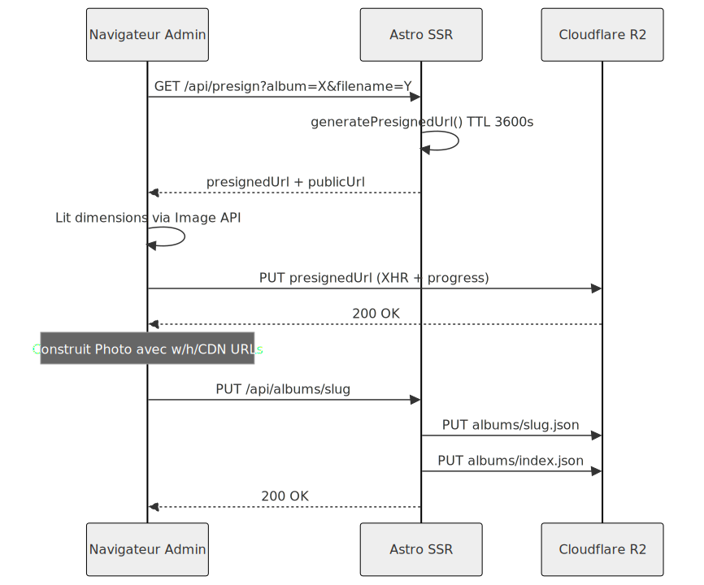
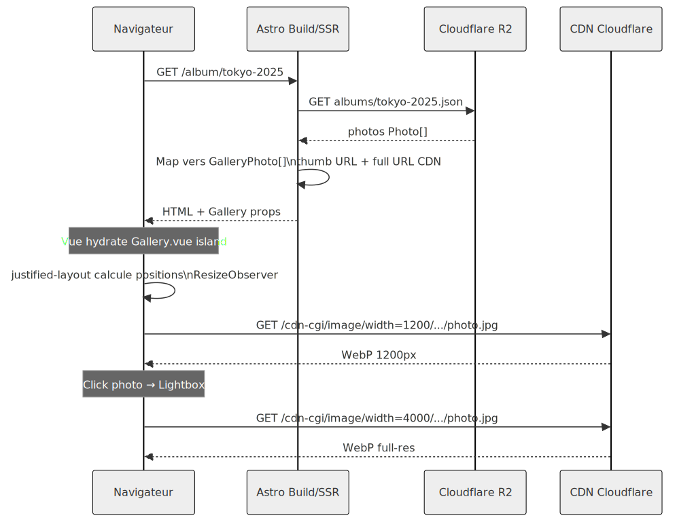

**Contexte**

J'utilisais Adobe Lightroom pour publier mes photos en ligne, mais l'abonnement Creative Cloud représente un coût mensuel disproportionné pour un usage essentiellement statique. J'ai donc développé mon propre portfolio photographique from scratch, avec un back-office d'administration intégré pour gérer albums et photos directement depuis le navigateur. Le projet couvre toute la chaîne : stockage objet, redimensionnement à la volée, galerie publique et interface d'administration.

**Stack & Architecture**

- **Astro 4 (hybrid)** — mode `output: 'hybrid'` : les pages publiques sont statiques (pré-rendues au build), les routes d'API et l'admin tournent en SSR. Évite un framework full-SPA pour du contenu majoritairement statique.
- **Vue 3** — utilisé uniquement pour les composants interactifs (galerie, lightbox, admin). Astro charge Vue à la demande via les islands, le reste est HTML pur.
- **Cloudflare R2** — stockage objet S3-compatible. Pas d'egress fee sur les lectures publiques, interface compatible AWS SDK. Les métadonnées des albums sont stockées en JSON directement dans R2 (pas de base de données).
- **Cloudflare Image Resizing** — redimensionnement à la volée via URL (`/cdn-cgi/image/width=1200,quality=78,format=webp/...`). Aucune pré-génération de vignettes nécessaire, cache CDN intégré.
- **Netlify** — hébergement avec adapter Astro. Un webhook de build permet de re-déployer le site statique depuis l'admin (bouton "Publier").
- **justified-layout** — bibliothèque Flickr open-source pour le calcul des positions de la grille justifiée. Recalcul via `ResizeObserver` à chaque changement de largeur du conteneur.

**Points techniques notables**

- **Upload direct navigateur → R2 via presigned URL** : l'API `/api/presign` génère une URL signée S3 (TTL 3600s), le navigateur PUT le fichier directement sur R2 sans transiter par le serveur Astro. Limite les coûts bande passante et les timeouts sur les gros fichiers.

- **Pas de base de données** : les métadonnées des albums et photos sont stockées sous forme de JSON dans R2 (`albums/index.json`, `albums/{slug}.json`). Suffisant pour une collection personnelle, élimine un service à maintenir.

- **Lightbox custom** (sans dépendance externe) : progressive loading (miniature floutée → full-res), zoom molette/pinch/double-tap (max 5×), pan avec clamping, navigation swipe, support clavier complet, affichage des données EXIF (appareil, objectif, ouverture, vitesse, ISO, lieu).

- **Métadonnées EXIF préservées de bout en bout** : le script CLI extrait via `exifr` les données EXIF (appareil, objectif, GPS, date de prise de vue) et les stocke structurées dans les JSON d'album. Elles sont affichées dans la lightbox publique.

- **Script d'import batch** (`npx tsx scripts/import.ts --album tokyo-2025 ~/Photos/*.jpg`) : upload concurrent (3 fichiers en parallèle), extraction EXIF automatique, cache `immutable` 1 an sur les objets R2, mise à jour atomique de l'index.

- **Rebuild statique à la demande** : le bouton "Publier le site" en admin déclenche un POST sur un build hook Netlify — le site public est regénéré statiquement avec les nouvelles données, sans exposer d'endpoint de contenu dynamique en production.

**Ce que j'ai appris / apporté**

Le challenge principal était l'hébergement et la configuration Cloudflare : comprendre le modèle hybride SSR/SSG d'Astro sur Netlify, mettre en place le pipeline de delivery via Cloudflare Image Resizing, et configurer les règles de cache pour que les images soient servies efficacement sans coût d'egress. Le second axe était les optimisations d'affichage côté client : galerie justifiée recalculée via `ResizeObserver`, progressive loading dans la lightbox (miniature floutée → full-res), et gestion cohérente du zoom/pan/swipe sur mobile sans librairie externe.

---

## Schémas

### Architecture globale

---

### Pipeline upload d'une photo

---

### Pipeline de delivery des images

---

### Structure des pages & routing

---

### Flux de données à l'affichage d'un album

